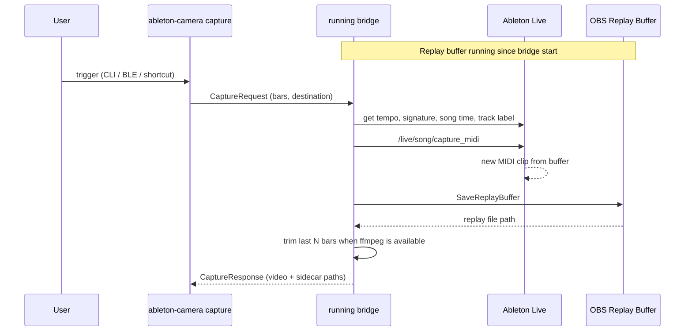

# Capture MIDI + replay buffer

Status: **implemented** as a bridge-owned capture flow.

This doc captures the **retroactive video** workflow tied to Ableton’s Capture MIDI feature. The running bridge owns Live OSC state, OBS WebSocket state, the selected output folder, and the project folder; `ableton-camera capture` is a small local control client that asks that bridge to capture now.

---

## Goal

When you’ve been improvising on armed MIDI tracks and want to **keep the last few bars of video** (not a full record pass), the bridge should:

1. Keep OBS **replay buffer** rolling in the background.
2. On demand, tell Live to **Capture MIDI** (materialize the buffered performance into a clip).
3. Save the last **N bars** of replay video to the session output folder (same project subfolder / naming conventions as normal takes).

**Non-goal for this mode:** match the saved video duration exactly to the new MIDI clip’s `length` in Live. In practice you usually want “last N bars of video” anyway, not the full captured MIDI span (which can be longer, quantized, or span more wall-clock time than you care about on camera).

---

## UX: CLI-driven capture (not the Live transport button)

Instead of detecting when the user presses **Capture MIDI** inside Live’s transport bar, the bridge **invokes** capture:

| Approach | Notes |
|----------|--------|
| **`ableton-camera capture`** (subcommand) | Sends a local control request to the running bridge. The bridge invokes `/live/song/capture_midi`, saves OBS Replay Buffer, and writes sidecars. Works from terminal, Shortcuts, Stream Deck, etc. |
| **Bluetooth / HID button** | Pair a BLE button (e.g. Flic, Nuimo, generic media remote mapped to a keyboard shortcut) to run the CLI or a small helper script. Lets you trigger capture away from the desk without wiring Live’s UI. |
| **Live transport Capture button** | Possible via M4L or patching `can_capture_midi` listen, but **not required** if the CLI is the primary trigger. |

### Why CLI-first is attractive

- Stock AbletonOSC already exposes **`/live/song/capture_midi`** as an **invoke** endpoint (no listener needed for the button).
- One-way control matches the existing bridge philosophy (bridge → Live / OBS), extended with a deliberate user action.
- Remote capture becomes “run a command” rather than fragile UI observation.

### Bluetooth button sketch

```
[BLE button] → (macOS) keyboard shortcut / Shortcuts / shell script
            → ableton-camera capture --bars 4
            → bridge control server
            → OSC capture_midi + OBS SaveReplayBuffer
```

Considerations:

- Button should map to something that doesn’t steal focus from Live if possible (Shortcuts “Run Shell Script” is fine).
- Debounce / lock so double-press doesn’t fire two saves.
- Optional `--dry-run` for testing without writing files.

---

## OBS: replay buffer (not normal record)

Normal bridge mode uses **Start/Stop Record**. Capture mode uses **Replay Buffer**:

| OBS WebSocket (v5) | Role |
|--------------------|------|
| `StartReplayBuffer` | Begin rolling buffer at bridge startup (or when entering capture mode). |
| `GetReplayBufferStatus` | Confirm buffer is active before save. |
| `SaveReplayBuffer` | Write a file when capture is triggered. |
| `StopReplayBuffer` | Optional on shutdown. |

**Settings (OBS → Output → Replay Buffer):** set maximum buffer duration ≥ the longest `--bars` you’ll request (e.g. 2–5 minutes). If the buffer is shorter than the requested window, you only get what’s in the buffer.

**Trimming to N bars:**

- Compute wall-clock duration from Live tempo:  
  `seconds = bars × beats_per_bar × 60 / tempo_bpm`  
  For 4/4: `seconds = bars × 240 / tempo_bpm`.
- **Preferred:** OBS build + obs-websocket support for saving only the last *N* seconds of the buffer (engine support for partial replay save has landed in recent OBS; confirm on your OBS version whether WebSocket exposes it).
- **Fallback:** save full replay file, then **ffmpeg trim** to the last `seconds` (or accept full buffer if trim is skipped for v1).

This is intentionally **decoupled** from `/live/clip/get/length` on the newly captured clip.

---

## Ableton: Capture MIDI over OSC

### What Live does

- Live continuously buffers MIDI on **armed** or **monitor-In** tracks.
- **Capture MIDI** creates a new MIDI clip from that buffer (session or arrangement depending on focus / destination).
- See [Ableton: Capture MIDI](https://help.ableton.com/hc/en-us/articles/360000776450-Capture-MIDI).

### LOM (for reference)

| LOM | Role |
|-----|------|
| `song.can_capture_midi` | Read-only, observable — capturable material exists. |
| `song.capture_midi(destination)` | Method — `0` auto, `1` session, `2` arrangement. |

### AbletonOSC today

| Address | Type | Notes |
|---------|------|--------|
| `/live/song/capture_midi` | **Invoke** | Already in AbletonOSC `song.py` — bridge can call this. |
| `/live/song/get/can_capture_midi` | **Not exposed** | Would need a small AbletonOSC patch + listen (optional, for UI feedback only). |

Optional later: listen `can_capture_midi` to grey out CLI or warn “nothing to capture” before calling `capture_midi`.

---

## End-to-end flow



**Ordering:** the bridge reads tempo/signature/song time, resolves the track label, invokes **Capture MIDI**, then saves OBS Replay Buffer. Replay content is “last N bars before save,” not “since clip was created.”

---

## Naming and output layout

Reuse session layout from main bridge:

- Output root: user-chosen folder (picker / `--output-dir`).
- Project subfolder: `--project` or default `YYYY-MM-DD`.
- Filename (example): `{track}_capture_{timestamp}.mkv` or `{track}_{timestamp}.mkv` with a `capture` suffix to distinguish from record-sync takes.

Track label: same resolution as `bridge/metadata.py` (armed → recording clip → selected).

---

## CLI

```bash
# One-shot capture: MIDI into Live + save last 4 bars of replay video
ableton-camera capture --bars 4

# Arrangement vs session destination for capture_midi
ableton-camera capture --bars 4 --destination session   # 1=session, 2=arrangement, 0=auto
```

`capture` requires the bridge to already be running. It uses the output folder/project selected by that bridge process and talks to the bridge over:

```yaml
control:
  host: 127.0.0.1
  port: 11002
```

---

## Comparison to current “record sync” mode

| | Record sync (current) | Capture + replay |
|--|------------------------|-----------------------------|
| **Trigger** | Live arrangement / session record | User CLI / BLE / shortcut |
| **OBS** | Start/Stop Record | Rolling replay buffer |
| **Video length** | Until Live stops | Last **N bars** (configurable) |
| **Ableton** | Passive listen | Active `capture_midi` invoke |
| **MIDI clip length** | N/A | Intentionally **not** matched to video |
| **Typical use** | Deliberate take | “Keep what I just played” |

Both modes can coexist: bridge starts replay buffer on launch; record-sync continues to use normal OBS record when Live transports.

---

## Risks and limitations

1. **Buffer cap** — Improvisation longer than OBS replay max → only the tail of the buffer is available, regardless of N bars.
2. **Tempo** — N bars → seconds uses current `song.tempo`; Capture MIDI on an empty set may change tempo after capture; small drift vs “bars you felt.”
3. **Multi-track armed** — Capture may create clips on multiple tracks; pick one track for naming or join armed names (same as today).
4. **No MIDI in buffer** — `capture_midi` may no-op or fail; CLI should check `can_capture_midi` if we add the OSC property, or surface Live errors.
5. **Hardware synth** — Only MIDI routed into Live is captured; audio-only monitoring without MIDI won’t populate the buffer ([Ableton manual](https://help.ableton.com/hc/en-us/articles/360000776450-Capture-MIDI)).
6. **Two OBS outputs** — Replay buffer + record simultaneously: confirm OBS allows both; may need policy (only one active) on low-end machines.

---

## Investigation notes (hooking Live’s Capture button — deprioritized)

If we ever want the **transport Capture MIDI button** to trigger video without the CLI:

| Method | Feasibility |
|--------|-------------|
| Listen `can_capture_midi` (LOM observable) | Needs AbletonOSC patch; edge 1→0 is imperfect (buffer consumed vs other state changes). |
| Detect new clip (`has_clip`, `clip.length`) | Works but false positives (manual clip creation). |
| Max for Live → OSC | Most reliable for true button hook. |
| macOS global shortcut hook | Fragile. |

**Decision:** CLI / remote trigger is simpler and matches the “last N bars” model; UI hook is optional later.

---

## Implementation phases

### Phase 1 — Prove OBS replay path

- [x] Start replay buffer from bridge on launch.
- [x] `ableton-camera capture --bars N` asks the running bridge to save replay.
- [x] Confirm file lands in project subfolder with sensible name.

### Phase 2 — Wire Capture MIDI

- [x] Call `/live/song/capture_midi` before saving replay.
- [x] Query tempo and time signature for bar → second conversion.
- [ ] Optional: patch AbletonOSC for `can_capture_midi` preflight.

### Phase 3 — Polish

- [x] `--destination`.
- [x] ffmpeg trim fallback.
- [x] Docs in SETUP.md (OBS replay buffer settings, capture command).
- [ ] Config defaults for capture bars/destination.
- [ ] Debounce for BLE double-tap.
- [ ] Log when requested bars exceed OBS replay buffer capacity.

---

## Resolved decisions

- Subcommand name: `capture`.
- `capture` requires the running bridge process.
- Filename pattern: `{track}_capture_{timestamp}.{ext}`.
- Replay Buffer starts whenever the bridge runs.

---

## Related docs

- [DESIGN.md](./DESIGN.md) — record-sync architecture, naming, output folder.
- [SYNC.md](./SYNC.md) — count-in, quantized session stop, clap test (record mode).
- [SETUP.md](./SETUP.md) — AbletonOSC, OBS WebSocket install.
