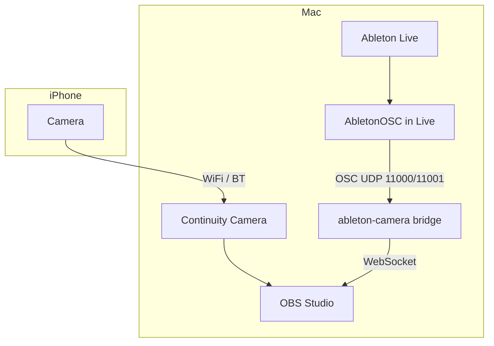

# Design: Ableton-triggered camera recording

## Goal

When the user starts recording in Ableton Live (**arrangement** or **session**), OBS on the Mac starts recording video from the iPhone (Continuity Camera). When recording stops, OBS stops and the file is moved into the **output folder chosen at app startup**, with a filename that includes **track** context and a timestamp.

This is **Option 3** from exploration: record on the Mac (not on the iPhone), no custom iOS app.

## Non-goals (v1)

- Sample-accurate or frame-locked A/V sync out of the box
- Custom iOS app or App Store distribution
- Reading project name or Live set path from Ableton (user picks the output folder instead)
- Per-clip-slot recording as a separate trigger (session + arrangement transport only)
- Controlling Ableton from the bridge (one-way: Live → OBS only)

## System context



## Components

| Component | Role |
|-----------|------|
| **Ableton Live** | User records audio; source of truth for start/stop |
| **AbletonOSC** | Remote script in Live; exposes LOM over OSC |
| **Bridge** (`ableton-camera`) | Prompt for output folder; subscribe to record state; command OBS; rename/move files |
| **OBS Studio** | Captures Continuity Camera; writes video via obs-websocket |
| **iPhone** | Camera only (Continuity Camera); not the recorder |

## Startup: output folder

On launch, the bridge **asks the user for the output directory** (no default project name from Live).

| Platform | v1 UI |
|----------|--------|
| macOS | Native folder picker (`tkinter.filedialog` or AppleScript `choose folder`) |
| Fallback | Terminal prompt: path string + validate directory exists (create if missing, with confirm) |

**Behavior:**

- Folder is required to continue; cancel → exit with message.
- Path is expanded (`~`) and stored for the **lifetime of the process** (until quit).
- All finalized videos go directly into this folder (no second “project” segment in the path).
- Optional: remember last folder in `~/.config/ableton-camera/last_output_dir` and pre-select it in the picker (nice-to-have, not blocking v1).

OBS still writes to a **staging** directory first (configured in OBS or `config.yaml`); on stop, the bridge moves the file into the user-chosen output folder.

## Trigger: what counts as “recording” (v1)

v1 supports **both** arrangement and session recording. The bridge treats recording as active if **either** signal is on.

### Arrangement Record

Transport **Arrangement Record** button (`live_set.record_mode`).

| LOM property | OSC get | OSC listen |
|--------------|---------|------------|
| `record_mode` | `/live/song/get/record_mode` | `/live/song/start_listen/record_mode` |

Replies: `/live/song/get/record_mode` with `0` or `1`.

### Session Record

**Session Record** transport state (`live_set.session_record_status`).

| LOM property | OSC get | OSC listen |
|--------------|---------|------------|
| `session_record_status` | `/live/song/get/session_record_status` | `/live/song/start_listen/session_record_status` |

Replies: `/live/song/get/session_record_status` with an integer. **Map during implementation** (log values while toggling Session Record in Live). Expected pattern: `0` = not recording, non-zero = recording active — confirm against [LOM Song](https://docs.cycling74.com/apiref/lom/song/).

### Combined logic

```
arrangement_on  = (record_mode == 1)
session_on      = (session_record_status != 0)   # exact mapping TBD in Phase 3
recording_active = arrangement_on OR session_on
```

**Edges (debounced):**

- `recording_active` false → true: start OBS, capture metadata
- `recording_active` true → false: stop OBS, finalize file

**On bridge startup:** query both getters once; if either indicates active, enter RECORDING (recover mid-take).

**Subscribe on start:**

```
/live/song/start_listen/record_mode
/live/song/start_listen/session_record_status
```

## Metadata for filenames

### Track name (from Ableton)

Ableton does not expose a single “track currently recording” property. **v1 rule:**

1. On record **start**, query all tracks for `arm == 1`.
2. If exactly one armed track → use its name.
3. If multiple → join names with `_` (e.g. `Vocals_Guitar`).
4. If none armed → use `selected_track` from `/live/view/get/selected_track`, then `/live/track/get/name`.
5. If still unknown → `UnknownTrack`.

| Data | OSC (stock AbletonOSC) |
|------|-------------------------|
| Track armed | `/live/track/get/arm` + `track_id` |
| Track name | `/live/track/get/name` + `track_id` |
| Selected track | `/live/view/get/selected_track` |
| Track count | `/live/song/get/num_tracks` |

### Filename pattern

```
{track}_{timestamp}.{ext}
```

- `timestamp`: local time at **record start**, `YYYY-MM-DD_HHMMSS`
- Sanitize track label: replace `/\:*?"<>|` and spaces with `_`
- `ext`: from OBS output (e.g. `mkv`); detect from staged file when moving

**Example** (user chose `/Users/me/Videos/MyAlbum/` at startup):

`/Users/me/Videos/MyAlbum/Vocals_2026-05-16_143022.mkv`

The folder name is the user’s organizational “project”; the app does not read it from Live.

### Output location

- **User folder:** chosen at app launch (see above).
- **OBS staging:** fixed path in config (where OBS writes before move).
- On record **stop**, bridge **moves** the finished file from staging → user folder with the final name.

## Bridge behavior

### State machine

```
IDLE ──(recording_active=1)──► RECORDING ──(recording_active=0)──► FINALIZING ──► IDLE
```

**On transition to RECORDING:**

1. Capture track label + timestamp (OSC queries).
2. Send OBS `StartRecord` (obs-websocket v5).
3. Note staging path / OBS record filename if returned.

**On transition to IDLE:**

1. Send OBS `StopRecord`.
2. Wait for file flush (poll staging dir or obs event).
3. Move to **session output folder** with computed filename.
4. Log outcome; on failure leave file in staging and log error.

### OSC transport

- Send to `127.0.0.1:11000`
- Listen on `127.0.0.1:11001`
- On startup (after folder chosen): subscribe both listeners; query both getters once

### OBS control

- [obs-websocket](https://github.com/obsproject/obs-websocket) (bundled with OBS 28+).
- WebSocket default `ws://127.0.0.1:4455`; password from config.
- Requests: `StartRecord`, `StopRecord`; optional `GetRecordStatus` while finalizing.

### Configuration file

`config.yaml` / `config.local.yaml` — **not** used for output folder (runtime prompt).

```yaml
osc:
  send_host: 127.0.0.1
  send_port: 11000
  listen_host: 127.0.0.1
  listen_port: 11001

obs:
  host: 127.0.0.1
  port: 4455
  password: ""  # OBS WebSocket settings

paths:
  staging_dir: ~/Movies/OBS-Staging   # where OBS writes; bridge moves from here

naming:
  track_merge: "_"   # between multiple armed track names

sync:
  obs_source_sync_offset_ms: 0  # documented in SYNC.md; user sets in OBS UI
```

## Sync strategy (latency)

**Instant sample-aligned start is not achievable** with this stack. Design for **repeatable** alignment (see future `docs/SYNC.md`).

| Stage | Typical magnitude |
|-------|-------------------|
| OSC + Python + obs-websocket | ~20–150 ms |
| OBS encoder start | ~1–3 frames |
| Continuity Camera | ~50–200+ ms vs real world |

- **Ableton Link** is not used and does not fix A/V file alignment for Option 3.
- **v1:** one-time clap test + OBS **Sync Offset** on the Continuity source.
- **v2 (optional):** continuous OBS record + timestamp sidecar; LTC / waveform align in post.

## Prerequisites

1. **Ableton Live 11+** + [AbletonOSC](https://github.com/ideoforms/AbletonOSC) as Control Surface.
2. **OBS Studio** + WebSocket server enabled.
3. **Continuity Camera** in an OBS scene.
4. **Python 3.11+** for the bridge.

## Security and scope

- Localhost only (OSC + OBS WebSocket).
- OBS password in `config.local.yaml` (gitignored).

## Failure modes

| Condition | Behavior |
|-----------|----------|
| User cancels folder picker | Exit cleanly with message |
| AbletonOSC not running | Log warning; retry subscribe on interval |
| OBS not reachable | Log error; retry on next record edge |
| No file in staging after stop | Log error; return to IDLE |
| Double start edge | Idempotent: already RECORDING → ignore |
| Bridge restarted mid-record | Query both getters on startup; sync state |
| Arrangement on while session on | `recording_active` stays true until **both** off |

## Testing (manual)

1. `/live/test` → Live status bar message.
2. Session Record on/off → bridge logs start/stop.
3. Arrangement Record on/off → bridge logs start/stop.
4. Full path → file in user-chosen folder: `TrackName_timestamp.ext`.
5. Clap test → OBS sync offset per SYNC doc.

## Repository layout (planned)

```
ableton-camera/
  README.md
  docs/
    DESIGN.md
    PLAN.md
    SYNC.md           # Phase 6
  bridge/
    __main__.py
    osc_client.py
    obs_client.py
    recorder.py
    metadata.py
    prompts.py        # output folder picker
    config.py
  config.example.yaml
  pyproject.toml
  .gitignore
```

## Open decisions (for review)

1. **Multiple armed tracks:** Join all names vs first armed vs selected track only?
2. **OBS output format:** Infer extension from staged file (preferred) vs fixed `.mkv`?
3. **Move vs copy** on finalize (default: **move**)?
4. **Count-in:** Start OBS immediately when `recording_active` goes true, or wait until `is_counting_in` is false?
5. **Folder picker:** `tkinter` only vs AppleScript on macOS for native sheet?
